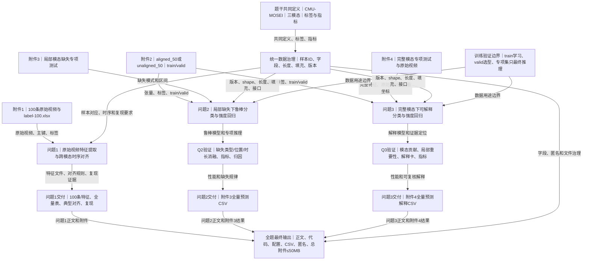

# 复杂场景下多模态情感预测的数学建模与算法设计

## 0. 小学应用题式题意还原

### 一句话版

用文字、声音和画面判断心情，并说明依据。

### 小学应用题版

小林拿到100段带文字、声音和画面的小视频，每段还有表示心情方向和强弱的分数。第一问：把每段视频中的三种记录都整理成数字，并把同一时刻的记录放在一起，保留每段有多少有效记录和原视频对应关系，做出可检查的文件。第二问：假如某种记录在一小段连续时间里看不见或听不见，但其他时间仍在，请设计办法，仍判断心情方向和强弱，并比较缺哪种记录、缺在什么位置、缺多久的影响，最后填写专门测试结果。第三问：记录都完整时，除了判断方向和强弱，还要说明主要看了哪种记录、各记录帮了多少、具体依据落在文字哪一段、声音哪一段或画面哪一格，最后填写另一份测试结果。

> ⚠️ 本节是帮助理解的类比版本，已丢失精度，**不可作为建模与求解依据**。实际建模必须回到第 3 节逐句翻译表与原始题面。

### 术语生活化映射表

| 原文专业术语 | 生活化替身 | 这个替身丢掉了什么 | 对应小问 |
|---|---|---|---|
| 多模态情感预测 | 同时看文字、声音和画面判断心情 | 三种数值表示、融合函数和训练过程 | 全题 |
| 文本语义 | 文字表达的意思 | 词元、向量表示和上下文编码 | 问题1—3 |
| 语音韵律 | 说话声音的快慢、轻重和起伏 | 具体声学维度、采样率和时间窗 | 问题1—3 |
| 面部表情与肢体动作 | 画面中人的表情和动作 | 关键帧、视觉特征维度和检测误差 | 问题1—3 |
| 情感特征提取 | 把原始记录整理成可计算的数字 | 工具、预训练模型和特征定义差异 | 问题1 |
| 时序对齐 | 把同一时刻的三种记录放在一起 | 采样频率差异、插值或截断规则 | 问题1 |
| 模态局部缺失 | 某种记录在连续一小段时间里不可用 | 零值编码和缺失区间精确边界 | 问题2 |
| 鲁棒预测 | 记录不完整时仍能稳定判断 | 不确定性、容错机制和退化度量 | 问题2 |
| 情感极性 | 心情偏向哪一边 | 三分类边界和中性点的严格定义 | 问题2—3 |
| 情感强度 | 心情有多强 | 连续区间、回归损失和相关性评价 | 问题2—3 |
| 可解释性预测 | 判断后说清楚主要依据 | 归因方法、作用量化和证据定位算法 | 问题3 |
| 训练集、验证集、专项测试集 | 练习材料、调试材料、最后检查材料 | 数据划分、标签可见性和防泄漏规则 | 问题2—3 |
| 对齐版与非对齐版 | 三种记录按同一格放置，或各自保留时间格 | 张量形状、有效长度和接口差异 | 问题2—3 |
| 关键证据定位 | 指出文字、声音或画面中哪一小段最重要 | token、时间段、帧索引与原视频映射 | 问题3 |

### 背景知识补课卡

| 需要补的背景 | 三句话说明 | 不懂会影响哪一问 |
|---|---|---|
| CMU-MOSEI | 这是题目指定的英文视频数据。每条样本由视频编号和片段编号共同确定。题目禁止用其他情感数据替代或扩充训练依据。 | 全题 |
| 三种信息的时间尺度 | 文字、声音、画面记录同一片段，但采样次数和时间粒度不同。需要先变成可比较的时间序列。否则缺失位置和证据位置没有共同坐标。 | 问题1—3 |
| 连续强度和三分类 | 强度是连续数值，极性是负向、中性、正向三类。数值为0只能算中性。 | 问题1—3 |
| 对齐与非对齐特征 | 对齐版本最多50个共同位置。非对齐版本文字最多50个位置，声音和画面各最多500个位置，并提供有效长度。 | 问题2—3 |
| 局部缺失 | 缺失不是整段视频完全没有某种信息，而是连续时间区间不可用。缺失类型、位置和时长都要作为实验因素。 | 问题2 |
| 可解释性证据 | 预测之外，还要说明哪个信息源起主要作用，以及证据落在文字片段、语音时段或视觉关键帧。 | 问题3 |

## 1. 整题概览

### 题目来源与标题锚点

- 来源文件：复杂场景下多模态情感识别的数学建模与算法设计.docx。
- 实际题面标题：复杂场景下多模态情感预测的数学建模与算法设计。
- 文件名使用“识别”，正文标题使用“预测”；论文与代码应以正文标题和具体输出要求为准。
- 标题前的“2026年中国研究生数学建模竞赛E题”是赛事识别信息，不纳入逐句台账。

### 整题精确理解

题目要求从英文视频的文字、声音和画面中构造可复现的时序特征，并在信息局部缺失或决策依据需要追溯时，完成情感极性分类和情感强度回归。问题1处理附件1的100条原始视频，建立特征提取、时序对齐和文件生成流程；问题2处理连续时间段的模态缺失，建立鲁棒预测模型并预测附件3；问题3在三模态完整时建立可解释预测模型并预测附件4。问题2和问题3共享附件2的训练/验证接口、标签定义、评价指标和特征版本规则，但分别使用附件3、附件4进行无标签专项推理。

数据来源、特征版本一致性、论文正文、可复现材料、CSV文件、总附件大小和匿名要求，均属于最终任务约束。

## 2. 逐句题意翻译与联动表

下表以题目标题后的实质内容为范围。Pxxx表示DOCX抽取的原始段落/表格位置；表1和表2的字段行按数据字典单元汇总，字段和值均保留。

| 编号 | 题干原句 | 通俗而精确的翻译 | 明示条件/数据 | 隐含建模信号 | 与前后内容的联动 | 漏读后果 | 后文必须出现的证据 | 来源页码/位置 |
|---|---|---|---|---|---|---|---|---|
| B01 | 复杂场景下多模态情感预测的数学建模与算法设计 | 要围绕多种信息、复杂场景和算法设计完成整套方案，而非只训练一个分类器。 | 多模态情感预测。 | 同时处理表示、缺失、预测和解释。 | 统领问题1—3。 | 把题目缩减成普通分类。 | 三个问题的共同变量、评价和交付物。 | P002，标题 |
| B02 | 情感分析是具身智能、自然人机交互等技术领域的关键支撑技术之一。真实交互中人类情绪通过文本语义、语音韵律、面部表情与肢体动作等多通道信号协同表达，多模态信息联合建模是突破单模态识别局限、提升复杂场景下情绪理解准确性与稳定性的核心路径。然而，多模态情感预测在落地中面临三重挑战：文本、语音、视觉模态在采样频率、特征维度与时间尺度上差异显著，特征提取与时序对齐的质量直接决定模型性能上限；实际采集常因画面遮挡、环境噪声、转写失败等导致模态局部缺失，常规固定权重融合模型性能急剧下降；多数模型仅能输出预测结果，决策依据难以追溯与复核，制约了模型的可信应用。本题以CMU-MOSEI英文多模态情感数据集为基础，围绕多模态特征提取与时序对齐、模态缺失条件下的鲁棒预测、可解释性情感预测三个层级开展系统性建模研究。 | 三种模态；三类挑战；CMU-MOSEI；三个层级。 | 采样/维度/时间差异、局部缺失、不可追溯。 | 三项挑战分别转化为问题1、问题2、问题3。 | 对应问题1、2、3。 | 只报告平均准确率，不能回应工程风险。 | 对齐接口、缺失实验、解释证据。 | P004，背景 |
| D01 | 本题提供如下数据与材料： | 以下附件是允许使用的输入和交付依据。 | 附件1—4。 | 数据来源和边界要可追溯。 | 引出D02—D13。 | 混淆原始数据、特征数据和专项数据。 | 附件清单和数据流图。 | P006 |
| D02 | 1．附件1：原始多模态样本 包含从CMU-MOSEI数据集中筛选的100条英文原始视频，具体描述如下： | 附件1是从指定数据集筛选的100条英文原始视频，是问题1的源输入。 | 样本数100。 | Q1必须全量处理。 | 连接D03—D05、Q1。 | 只处理展示样本。 | 100条样本清单和状态表。 | P007—P008 |
| D03 | 附件包含37个子文件夹，其命名为原始视频标识video_id；每个子文件夹包含一个或多个视频片段，命名clip_id.mp4。video_id和clip_id共同确定一条视频样本。所有视频时长介于2.648秒和34.567秒之间。 | 文件夹名是video_id，片段名是clip_id；二者共同组成主键，时长在给定区间内。 | 37个文件夹；主键video_id+clip_id；2.648—34.567秒。 | 不能只按video_id去重；时长要质量检查。 | Q1索引、时长和回溯记录。 | 错配、重复或漏样本。 | 主键唯一性、时长统计、原始文件清单。 | P009 |
| D04 | 附件同时提供视频标注对应表（label-100.xlsx），每一行对应一个视频样本。其中，video_id列和clip_id列对应子文件夹名称和文件名；text列为该视频片段对应的英文转写文本；label列为连续情感强度标注，取值：[-3,0)（负向）、0（中性）、(0,3]（正向），数值越接近-3表示负向程度越强，越接近3表示正向程度越强；0仅属于中性，不同时归入负向或正向。；annotation列为情感极性的英文文字标签，取值：Negative（负向情感）、Neutral（中性情感）、Positive（正向情感）。 | 每行对应一个样本；label是连续强度，annotation是三分类文字标签；0只能是中性。 | 区间边界和标签含义固定。 | video_id、clip_id、text、label、annotation共同构成标签核对接口。 | Q1标签核对、Q2/Q3分类和回归目标。 | 边界错误会污染训练和评价。 | 标签映射、0值核验、分类/回归指标。 | P010 |
| D05 | 注：本附件所有内容由赛题统一提供。参赛队不得自行替换、增补、删除或修改样本及其标签；如需在模型处理中对极短、无效或异常片段采取掩码、截断或其他处理，应保留原始样本，并在报告中说明处理规则。 | 原始附件不能改；如做掩码、截断或异常处理，原件必须保留且规则要公开。 | 禁止替换、增补、删除、修改。 | 数据治理是硬约束。 | Q1预处理、复现、提交。 | 处理后不可审计或违规。 | 原始/处理后对照、日志和规则。 | P011 |
| D06 | 2．附件2：CMU-MOSEI标准化多模态特征文件（.pkl格式） 本附件提供：对CMU-MOSEI公开数据中有效的部分视频片段进行处理后、可直接用于建模的特征文件，包含对齐和非对齐各4850条样本，以及样本标签对应的excel表格。样本按训练/验证/测试划分组织，包括文本、语音、视觉三模态各自的特征矩阵、标签映射、维度定义与存储格式说明（数据形式和解释见后面补充说明）。参赛队可以根据情况选择附件2中的数据开展问题2和问题3建模。 | 附件2提供4850条对齐和4850条非对齐标准特征，含标签和train/valid/test划分，Q2/Q3可二选一使用。 | 版本选择需固定，不能拼接。 | 附件2为Q2/Q3的标准化输入来源，后文另行规定字段和形状。 | Q2/Q3训练、验证和专项推理。 | 混用版本导致接口漂移。 | 版本记录、划分统计、读取代码。 | P012—P013 |
| D07 | 3．附件3：模态局部缺失专项测试集 包含若干无标签样本对应的处理后的带有随机模态缺失的特征文件，用于模态局部缺失专项测试。其中，模态缺失指样本局部信息不可用，即一个或多个模态中存在特征值全部为零的随机连续序列区间。 | 附件3无标签，缺失是一个或多个模态的连续零值区间，用于Q2最终测试。 | 无标签；连续区间；一个或多个模态。 | 缺失类型、位置和长度是实验因素；不能调参。 | Q2模型流向附件3。 | 当成整模态缺失或验证集。 | 缺失掩码、分组消融、全量CSV。 | P014—P015 |
| D08 | 4．附件4：可解释性专项测试集 包含若干无标签真实场景视频及对应的三模态特征文件，三模态信息完整。特征字段、张量维度和时序组织方式与附件2保持一致；配套原始视频用于将模型给出的关键证据时间位置回看至文本、语音或视觉片段。 | 附件4三模态完整、接口同附件2，并提供原始视频供Q3证据回看。 | 无标签；三模态完整；字段/形状/时序一致。 | 解释结果必须有原始坐标。 | Q3模型流向附件4。 | 只给模态权重，无法回看。 | 证据坐标、片段/时段/帧和解释CSV。 | P016—P017 |
| D09 | 注：以上特征文件分别提供与附件2 aligned_50.pkl 和 unaligned_50.pkl 对应的两套版本。参赛队应在训练、验证和专项测试中保持同一特征版本和同一输入接口。 | 附件2—4均有两套对应版本；一旦选择，训练、验证、专项测试必须保持同版本、同接口。 | 版本统一；接口统一。 | Q2/Q3硬约束。 | 连接F01、F-T1、Q2、Q3。 | 训练和测试形状不一致。 | 配置、shape断言和端到端接口。 | P018 |
| T01 | 本题依次要求完成多模态特征提取与时序对齐、模态缺失条件下的鲁棒情感预测、可解释性情感预测三项建模任务。 | 全题包含Q1特征与对齐、Q2缺失鲁棒性、Q3可解释性三项任务。 | 三项任务。 | Q2/Q3共享接口和评价，但不是必然串行。 | 形成三分支汇总。 | 三问互不关联。 | 统一变量、接口和交付关系。 | P020 |
| Q1-01 | 问题1：多模态情感特征提取与时序对齐的数学建模 | 第一问要从原始视频得到三模态时序特征并对齐。 | 输入附件1。 | 重点是可复现的生成机制。 | 连接Q1-02、Q1-03。 | 只写网络不写输入生成。 | 流程、定义、规则、文件。 | P021 |
| Q1-02 | 基于附件1提供的原始视频，建立文本、语音、视觉三模态情感特征提取与时序对齐的数学模型，模型须明确原始样本的处理流程、各模态情感特征的定义与提取方法、跨模态时序对齐的规则与实现逻辑。参赛队可使用开源工具或预训练模型完成特征提取基础处理。 | 以附件1为源，说明原始视频如何处理、三种特征是什么、如何提取、时间轴如何对应；工具可开源，但接口和逻辑要明确。 | 流程、定义、提取、规则、实现；允许开源工具/预训练模型。 | 工具不能替代模型语义。 | 为Q1-03和R04—R07提供基础。 | 只报工具名，没有特征和对齐定义。 | 特征维度、索引、流程、版本和参数。 | P022 |
| Q1-03 | 参赛队在问题1中自行生成的特征文件需达到如下要求：一是原始样本覆盖完整性，包括样本编号、模态文件与输出特征是否一一对应；二是时序组织的可核验性，包括序列位置、有效长度、填充规则及其与原始素材的对应记录；三是方法的合理性与可复现性，包括特征提取工具、关键参数、处理日志和复现实验说明。 | 自生成文件要证明样本、模态和特征一一对应；记录序列位置、长度、填充和原素材关系；提供工具、参数、日志和复现。 | 覆盖、可核验、合理、可复现。 | 文件schema本身是评分证据。 | 连接A01和R04—R07。 | 生成但无法追溯。 | 样本清单、schema、mask、日志、复现说明。 | P023 |
| Q2-01 | 问题2：模态信息缺失条件下的情感预测建模与验证 | 第二问研究局部信息损坏时的鲁棒预测和影响规律。 | 局部缺失输入。 | 不是删除整种模态。 | 连接Q2-02、Q2-03。 | 直接套完整模态模型。 | 缺失机制、模型、验证。 | P024 |
| Q2-02 | 针对局部时段模态信息缺失的复杂场景，构建鲁棒性多模态情感预测模型。模态局部缺失指文本、语音或视觉中的部分连续时间段不可用，并不表示整个模态完全不存在。模型需在局部模态信息不完整的条件下稳定输出情感极性与情感强度预测，并分析缺失模态类型、缺失位置、缺失时长对预测性能的影响规律。 | 处理文本、声音或画面某些连续时间段不可用的情况，同时输出三分类极性和连续强度，并比较缺失类型、位置、时长的影响。 | 局部连续缺失；分类+回归；三类缺失因素。 | 需要掩码/缺失机制、分组实验和退化分析。 | 使用附件2 train/valid；结果供Q2-03。 | 只给一个平均分。 | 消融矩阵、四项指标、可视化、归因。 | P025 |
| Q2-03 | 使用所建立的鲁棒性情感预测模型，对附件3中的测试样本完成推理预测，按第四条结果与提交说明提交预测结果文件。 | 固定模型后对附件3全量推理，按第四部分交结果文件。 | 专项测试；最终推理。 | 不能测试集调参。 | 流向A02、R10。 | 漏样本或格式错误。 | 逐样本CSV、列定义、命名。 | P026 |
| Q3-01 | 问题3：可解释性情感预测建模与验证 | 第三问要求预测结果能被量化、复核和回看。 | 三模态完整。 | 解释是模型输出的一部分。 | 连接Q3-02—Q3-04。 | 只做性能模型。 | 解释模型和证据。 | P027 |
| Q3-02 | 针对三模态信息完整但决策依据难以追溯的场景，构建可解释性多模态情感预测模型。可解释性指模型在给出情感预测结果的同时，能够以可量化、可复核的方式说明本次判断主要依据了哪些输入信息，包括不同模态在当前样本中的作用差异、对预测起主要作用的模态，以及各模态中与判断密切相关的局部片段。 | 完整三模态下，除了预测还要量化模态作用、指出主模态并定位局部片段。 | 可量化、可复核、模态差异、主模态、局部片段。 | 需要定义归因量、基线和证据坐标。 | 连接Q3-03、R12—R14。 | 只有不可复核的热图。 | 贡献、排序、局部分布、映射。 | P028 |
| Q3-03 | 模型需同时输出情感极性、情感强度预测结果，以及主要参考模态、模态作用程度、关键证据定位等可解释性分析结果，关键证据需可对应至原始文本片段、语音时段或视觉关键帧。 | 每条输出含极性、强度、主要模态、作用程度和证据位置；证据必须回到文字、时段或关键帧。 | 五类输出。 | 输出schema是硬要求。 | 连接Q3-04、A02。 | 漏解释字段或无法回看。 | 解释CSV、证据坐标、样本卡。 | P029 |
| Q3-04 | 使用所建立的可解释性情感预测模型，对附件4中的测试样本完成推理预测，按第四条要求格式提交预测结果与解释文件。 | 固定模型后对附件4全量推理，提交预测和解释文件。 | 专项测试；预测+解释。 | 不能测试集调参。 | 流向A02、R15。 | 只提交预测。 | 全量预测解释CSV。 | P030 |
| E01 | 说明：问题2与问题3的模型均在附件2提供的训练集上学习模型参数，在验证集上选择模型结构、超参数与决策阈值；附件3、附件4为无标签专项测试集，仅用于相应专项模型的最终推理预测。分类任务（情感极性）采用准确率（Accuracy）、F1值评价，回归任务（情感强度）采用平均绝对误差（MAE）、皮尔逊相关系数评价。 | Q2/Q3参数来自train，结构、超参和阈值由valid选择；附件3/4只最终推理；分类用Accuracy/F1，回归用MAE/Pearson。 | 数据用途和四项指标固定。 | 分类回归双头、测试隔离。 | 约束Q2/Q3和R09—R16。 | 测试泄漏或只报单指标。 | 划分日志、四项指标、隔离证明。 | P031 |

| R01 | 所有提交内容需严格对应本题各问题的任务要求，在参赛论文中完整、规范呈现。 | 每份提交物都要能回指题目问题，并在论文中完整呈现。 | 内容与问题逐项对应。 | 论文是任务验收载体。 | 统领R02—R16、A01—A03。 | 关键结果只放附件。 | 问题—结果—文件对应表。 | P033 |
| R02 | 参赛论文需按照竞赛统一格式规范撰写，所有问题的方法原理、建模过程、实验结果与分析结论均须系统纳入正文，不得仅存放于附件。 | 正文必须有原理、过程、结果和结论；附件不能替代正文。 | 所有问题；正文完整。 | 论文、代码、结果需一致。 | 连接R03、A01、A02。 | 正文缺核心证据。 | 逐问章节中的方法、结果和分析。 | P035 |
| R03 | 论文应依次回应问题1、问题2和问题3，并在每个问题中说明数据输入、方法或模型、求解过程、评价指标和主要结果。参赛队可自主安排理论推导、算法细节、消融实验和创新讨论，但不得省略题目规定的核心输出、结果文件说明和必要的实验依据。 | 论文按Q1—Q3组织，每问写输入、方法、求解、指标、结果；可加推导和创新，但不能删核心输出。 | 顺序、五类正文要素、核心输出。 | 论文目录应跟数据流一致。 | 连接R04—R16。 | 结构错位或遗漏核心交付。 | 逐问写作核对表。 | P037 |
| R04 | (1)特征提取与时序对齐整体方案：说明文本、语音、视觉三类模态的特征定义、提取方法与所用工具，阐述时序对齐的核心规则与跨模态时间对应逻辑，完整呈现从原始素材到标准化时序特征的处理流程。 | Q1正文展示三模态特征、工具、时间规则和从原始视频到标准序列的全过程。 | 三模态、定义、工具、规则、流程。 | 需要流程图和接口。 | 连接Q1-02、Q1-03。 | 只给最终张量。 | 流程、公式/伪代码、参数、对齐图。 | P039 |
| R05 | (2)特征文件规范与全量结果汇总：说明自生成特征文件的存储格式、组织结构与读取方式；以表格形式汇总附件1全部100条样本的特征提取结果，包含样本编号、模态类型、原始有效时长、特征维度、对齐粒度等关键信息，确保全量结果可追溯、可核验。全量原始特征文件随附件提交。 | Q1要说明自生成文件如何存取，并以表格覆盖100条样本，至少列出编号、模态、时长、维度和对齐粒度；原始文件随附件提交。 | 全量100条；五类汇总字段；原始文件。 | 全量表是硬交付。 | 连接Q1-03、A01。 | 只给抽样或压缩模型。 | 100条表、schema和附件。 | P040 |
| R06 | (3)典型样本验证：选取至少1个典型样本，展示其文本片段、对应语音时段、视频帧段与三类特征的对应关系，呈现时序对齐效果。 | 至少1个样本要用文字、声音时段、画面帧段和特征位置证明对齐成立。 | 至少1个；四者对应。 | 典型样本是可读的外部验证。 | 连接Q1-02、Q3证据回看。 | 只有数组无对应关系。 | 带时间轴的对齐图。 | P041 |
| R07 | (4)方案可复现性说明：标注所用工具与模型的版本、核心参数及完整运行流程，保障结果可复现。 | 记录工具/模型版本、参数和完整运行步骤。 | 版本、参数、流程。 | 代码、配置、日志要一致。 | 连接Q1-03、A01。 | “使用开源工具”仍不可复现。 | 环境、配置、日志、README。 | P042 |
| R08 | (1)鲁棒性模型的建模原理、网络结构、目标函数、训练方案与关键参数； | Q2正文写模型原理、结构、目标、训练和参数。 | 五类模型证据。 | 不能只报分数。 | 连接Q2-02、E01。 | 模型不可复现。 | 结构图、目标函数、配置。 | P044 |
| R09 | (2)缺失模态类型、缺失率对预测性能影响的规律分析与消融实验结果； | Q2比较缺失类型和程度对性能的影响，并给出消融。 | 类型、缺失率、规律、消融。 | 需要控制变量和统一指标。 | 连接Q2-02、E01。 | 一次随机缺失被误当规律。 | 分组表、曲线、重复实验。 | P045 |
| R10 | (3)附件3测试集的全量预测结果汇总与结果展示； | Q2展示附件3每个样本的预测结果。 | 全量附件3。 | 结果文件与正文一致。 | 连接Q2-03、A02。 | 漏样本或只报均值。 | 样本级CSV和汇总。 | P046 |
| R11 | (4)验证集上的基础性能评价、可视化分析与错误归因结论。 | Q2在valid给指标、图形和错误原因。 | 验证集；指标；可视化；归因。 | 归因应结合缺失情景。 | 连接E01、模型选择。 | 无法解释退化。 | 混淆矩阵/误差图和案例。 | P047 |
| R12 | (1)可解释性模型的建模原理、网络结构、目标函数、训练方案与关键参数； | Q3正文完整说明解释模型。 | 五类模型证据。 | 解释机制需定义清楚。 | 连接Q3-02、E01。 | 事后热图代替方法。 | 结构、目标、参数、验证。 | P049 |
| R13 | (2)典型样本解释卡（含预测结果、三模态作用程度、主要参考模态及关键证据定位）； | 至少制作解释卡，含预测、三模态贡献、主模态和证据位置。 | 四类解释卡字段。 | 解释同时有全局和局部层次。 | 连接Q3-03、Q3-04。 | 只说“模型关注文本”。 | 完整解释卡和坐标。 | P050 |
| R14 | (3)主要参考模态内局部片段重要性分布可视化、三模态作用差异对比分析； | 画主模态内部重要性分布，并比较三种模态的作用差异。 | 局部分布、三模态对比。 | 贡献需展开到时间/词/帧。 | 连接Q3-02、Q3-03。 | 没有局部证据。 | 热图/曲线、归一化和结论。 | P051 |
| R15 | (4)附件4测试集的全量预测与解释结果汇总； | Q3汇总附件4所有样本的预测和解释。 | 全量；预测+解释。 | 不能只展示典型样本。 | 连接Q3-04、A02。 | 漏交全量解释。 | 样本级CSV和汇总。 | P052 |
| R16 | (5)验证集上的基础性能评价、可视化分析与错误归因结论。 | Q3也要在valid评价性能、画图并分析错误。 | 验证集；指标；可视化；归因。 | 解释可靠性也要验证。 | 连接E01、模型选择。 | 解释没有可信度证据。 | 指标、案例、错误分析。 | P053 |
| A01 | 1.可复现核心材料：问题1自主生成的100条样本多模态时序特征文件，问题2和问题3两类专项模型的核心代码、说明文档、模型参数文件、配置文件与运行环境说明。代码须附带详细运行说明、数据集处理规则与参数配置，确保实验结果可完整复现。 | 附件包含Q1的100条特征，以及Q2/Q3的代码、文档、权重、配置、环境和处理规则。 | 100条特征；代码、文档、参数、配置、环境。 | 复现包是独立交付物。 | 连接Q1-03、R07、R08、R12。 | 只交论文或源代码。 | 目录、README、环境和日志。 | P055 |
| A02 | 2.专项测试结果文件：附件3测试集预测结果CSV文件、附件4测试集预测与解释结果CSV文件，文件命名清晰规范。 | 至少交两个专项CSV，分别对应附件3预测和附件4预测+解释。 | CSV；两个专项文件；命名清晰。 | 样本ID、列和顺序要稳定。 | 连接Q2-03、Q3-04。 | 文件不可导入或无法对应。 | 列字典、行数、主键。 | P056 |
| A03 | 总附件大小须符合竞赛统一要求（≤50MB），所有提交材料中严禁出现参赛单位、队员姓名、队伍编号等身份信息，违者按竞赛违规处理。 | 全部附件不超过50MB，任何文件和元数据不得出现身份信息。 | ≤50MB；匿名硬约束。 | 压缩不能损害复现；要扫描元数据。 | 最终提交闸门。 | 技术正确但违规。 | 大小检查、匿名扫描。 | P057 |
| U01 | 本题所有建模任务均以赛题提供的CMU-MOSEI系列数据为唯一数据来源，参赛队不得引入其他任何公开或私有情感数据集参与模型训练、微调、参数优化、阈值选择或结果统计。 | 训练、微调、调参、阈值和统计只能依赖赛题提供的CMU-MOSEI系列数据。 | 唯一数据源；五类用途受限。 | 数据来源限制贯穿全流程。 | 连接Q1—Q3、A01。 | 外部数据泄漏。 | 数据清单、脚本、实验记录。 | P060 |
| U02 | 参赛队可在合理论证前提下，对附件2的训练集、验证集数据开展清洗、重采样、标准化等基础预处理，也可基于该数据开展消融实验与规律分析。 | 允许有理由地处理附件2 train/valid并做消融，但要记录规则。 | 清洗、重采样、标准化等；对象为train/valid。 | 不能将专项集纳入预处理调参。 | 连接E01和Q2/Q3实验。 | 测试污染或处理不可复现。 | 前后统计、随机种子、规则。 | P061 |
| U03 | 本题所有问题的建模工作均允许使用开源特征提取工具、预训练模型与开源算法框架，但须在论文中统一标注所涉工具与模型的名称、版本号及核心参数设置，明确其使用场景。 | 可用开源工具、预训练模型和框架，但必须写名称、版本、参数和用途。 | 允许工具；必须记录四类信息。 | 允许不等于免除解释和复现。 | 连接Q1、R07、A01。 | 版本不明。 | 工具清单、环境、参数。 | P062 |
| F01 | CMU-MOSEI数据集提供两个已处理特征文件：aligned_50.pkl和unaligned_50.pkl，选手可自行选择使用，但须在训练、验证和专项测试中保持同一版本。二者均以Python Pickle字典格式保存。 | 对齐和非对齐二选一；内部是Pickle字典；版本贯穿训练、验证和专项测试。 | 两个文件；版本统一。 | 版本是实验设计变量。 | 连接D09、F02、F-T1。 | 读取或版本不一致。 | 配置、加载器、shape断言。 | P064 |
| F02 | 文件结构：最外层按数据用途划分为train、valid、test三个顶层键。进入任一顶层键后，文件按字段集中保存该划分下的全部样本，即data['train']['audio']表示训练集所有样本的语音特征。各字段中同一索引位置的取值共同描述同一条样本，读取方式为data['train'][字段名][j]（j为样本索引，Python从0开始计数），而非data['train'][j][字段名]。 | 先按划分再按字段存储，同一字段数组相同索引才是同一样本；j从0开始，不能按样本索引套字段。 | train/valid/test；字段集中存储。 | 数据加载和样本对齐要按字段索引。 | 连接F03、F-T2和模型输入。 | 样本错配或维度错误。 | 键集合、索引一致性和加载测试。 | P065 |
| F03 | 特征形状与时序组织：两个文件的矩阵形状如下表所示，第一维N为当前划分的样本数，后两维分别为序列位置数和特征维度。 | 模态矩阵第一维是样本数，后两维是时间位置和特征维度。 | N、序列位置、维度。 | 不能混淆时间和特征维。 | 连接F-T1、F04。 | 模型或mask错位。 | 每个split的shape打印。 | P066 |
| F-T1 | 表1 附件2两类特征文件的矩阵形状；文件；文本特征；语音特征；视觉特征；时序含义；aligned_50.pkl；(N, 50, 768)；(N, 50, 74)；(N, 50, 35)；三模态均按最多50个相互对应的序列位置组织；unaligned_50.pkl；(N, 50, 768)；(N, 500, 74)；(N, 500, 35)；文本保持50个位置；语音、视觉保留独立时序，有效长度见audio_lengths、vision_lengths。 | aligned三模态最多50个共同位置；unaligned文字50、声音和画面各500并各自保留有效长度。 | 具体形状、时序和有效长度固定。 | 版本和接口选择影响下游模型。 | 表1是Q2/Q3输入、mask和证据坐标的直接接口。 | 强行把非对齐版当共同时间轴。 | 配置、shape表和长度处理。 | P067—P082，表1 |
| F04 | 文件名中的50表示统一采用的最大序列位置数。所有样本存储形状相同，有效位置数可能小于最大长度，其余位置按文件规则填充。语音特征维度74由原始提取流程确定，本赛题将其视为统一输入维度，不对其每一维的具体物理含义作额外假定。 | 50是最大长度，不是每条样本真实长度；不足位置按规则填充；语音74维只作为统一输入，不需臆测每维物理意义。 | 最大长度、有效长度、填充、audio 74维。 | 需要mask，不能把填充当信号。 | 连接Q1可核验性和Q2/Q3序列处理。 | 虚构特征语义或污染池化。 | padding规则、mask、长度统计。 | P083 |
| F-T2 | 字段含义：主要字段如表2所示；表2 附件2主要字段含义；字段；含义；使用说明；id；字符串，格式为video_id$_$clip_id；唯一标识一条建模样本；raw_text；原始英文转写文本；用于阅读核查，非数值特征；text；连续文本特征，50×768；已经预计算的BERT类文本表示，可直接输入模型；text_bert；BERT三路整数输入，3×50；词元编号、注意力掩码和分段编号，需经BERT编码后使用；与text二选一，不构成第四种模态；audio / vision；语音或视觉时序特征；形状见表1；annotations / classification_labels / regression_labels；文字极性、三分类标签、连续情感强度；情感标注定义与问题2一致。 | 表2定义样本ID、原文、两种文本接口、语音/视觉特征和标签字段；text与text_bert二选一，不增加第四模态。 | 字段语义、shape、标签和用途固定。 | 这些字段共同定义一个样本和其标签接口。 | 表2直接约束加载、模型输入、标签目标和证据回映射。 | raw_text当数值输入，或把text_bert当第四模态。 | 字段字典、输入选择、标签核对。 | P084—P106，表2 |
| F11 | 读取示例： | 题面引出读取示例，但文本抽取未见完整示例正文。 | 需视觉核对DOCX。 | 可能影响实现。 | 连接F02和加载器。 | 错误实现字段/索引。 | 原文视觉核查和单元测试。 | P107 |
| F12 | 附件2保存的是处理后的数值特征和标签，不保存原始视频帧、音频波形或逐词时间戳。为帮助参赛者理解这些字段在原始视频中的来源及其时间关系，图3用一个独立的多模态样本示意同一时间轴上的视觉、音频、文本和标签信息。 | 附件2没有原始帧、波形或逐词时间戳；图示只解释字段来源和共同时间关系。 | 处理后特征/标签；无原始帧、波形、逐词时间戳。 | 不得把位置直接说成真实逐词时间。 | 连接Q1对齐和Q3证据回看。 | 证据坐标虚构。 | 时间坐标来源和证据粒度。 | P108 |
| F13 | 图1 多模态视频片段的原始信号、文本时间戳与情感标签示例 | 图注说明一个样本的原始信号、文本时间和标签在时间轴上的示意关系。 | 图注写为图1。 | 与F12的“图3”不一致。 | 连接Q1典型样本和Q3回看。 | 论文图号混乱。 | 原DOCX核对、定稿统一图号。 | P109 |
| R17 | 参考文献；[1]—[10]为多模态情感、缺失模态、动态专家、证据定位和知识蒸馏方向的10条文献。 | 参考文献用于背景和方法检索，不改变题目硬约束，也不授权引入外部情感数据。 | 10条参考文献。 | 文献方向是思路线索，不是必须复现模型。 | 可供后续建模思路参考。 | 把文献方法当成题目强制模型。 | 引用核验、方法来源和数据边界。 | P110—P120 |

## 3. 核心术语与口径表

| 术语 | 题目原始定义 | 建议采用的精确口径 | 单位/范围 | 影响问题 | 歧义或注意事项 |
|---|---|---|---|---|---|
| 情感极性 | Negative、Neutral、Positive；label<0、=0、>0 | 三分类，0只归Neutral | 类别 | Q2—3 | 不得重复归类0 |
| 情感强度 | label在[-3,3]；靠近-3/3表示程度更强 | 连续回归目标 | 分数 | Q1—3 | MAE和Pearson |
| video_id、clip_id | 文件夹和片段共同确定样本 | 以二者组合作主键；附件2 id保持原格式 | 样本级 | 全题 | 不只按video_id聚合 |
| 局部模态缺失 | 一个或多个模态的连续零值区间 | 按模态、起止位置、长度记录 | 序列/时间 | Q2 | 非整模态缺失 |
| aligned_50 / unaligned_50 | 表1给出的两套特征接口 | 二选一并贯穿train/valid/专项测试 | 形状见F-T1 | Q2—3 | 不跨版本 |
| 有效长度和填充 | 实际长度可能小于存储长度，剩余位置填充 | 用于mask、池化和证据坐标 | 序列位置 | Q1—3 | 填充不是有效信号 |
| text / text_bert | 连续文本特征或BERT三路整数输入 | 同一文本模态两种接口，二选一 | 50×768或3×50 | Q2—3 | 不构成第四模态 |
| audio / vision | 语音和视觉时序特征 | 按表1读取，audio 74维、vision 35维 | 特征维 | Q1—3 | 不臆测audio每维物理意义 |
| train / valid / test | Pickle顶层划分 | train学参数，valid选型；专项附件只最终推理 | 样本划分 | Q2—3 | 附件2 test调参用途未明 |
| 可解释性和关键证据 | 可量化、可复核地说明依据并定位到原始片段 | 输出贡献、主模态、局部位置和回看坐标 | 样本+局部 | Q3 | 仅热图不够 |
| 唯一数据来源 | 只能用赛题CMU-MOSEI系列数据做训练、微调、调参、阈值和统计 | 外部情感数据不得进入上述环节 | 全流程 | 全题 | 预训练工具使用边界需说明 |

### 实际附件只读核验

- 附件1实际包含100条MP4和label-100.xlsx；标签表101行含表头。
- 附件2包含aligned_50.pkl、unaligned_50.pkl和label.xlsx；两套Pickle均有train/valid/test，实际样本数为3395/728/727。
- 实际读取形状与题面一致：aligned为text (N,50,768)、audio (N,50,74)、vision (N,50,35)；unaligned为text (N,50,768)、audio (N,500,74)、vision (N,500,35)，并带audio_lengths、vision_lengths。
- 附件3、附件4的无标签状态和逐文件样本顺序仍应在后续数据盘点中核验，不能仅凭文件名推断。

## 4. 各问输入—任务—输出表

| 问题 | 直接输入 | 需要解决的任务 | 必须满足的约束 | 最终输出 | 依赖前问内容 | 将被后问复用的内容 |
|---|---|---|---|---|---|---|
| 问题1 | 附件1原始视频和label-100.xlsx | 定义三模态特征；设计提取和对齐；生成文件接口 | 100条全覆盖；不改原件；记录主键、长度、填充、对应关系、版本、日志；至少1个典型样本 | 100条特征文件、全量表、对齐验证、复现说明 | 无 | 可复用时序/特征接口思想；题面不要求Q2/Q3必须使用Q1文件 |
| 问题2 | 附件2 train/valid特征；附件3缺失专项集 | 鲁棒分类+回归；分析缺失类型、位置、时长/率；预测附件3 | train学习，valid选型；附件3只最终推理；版本和接口一致；Accuracy、F1、MAE、Pearson | 模型、验证指标、消融/可视化/归因、附件3全量预测CSV、复现包 | 共享标签、接口和评价，不强制依赖Q1文件 | 可与Q3共享加载、评价、结果管理 |
| 问题3 | 附件2 train/valid完整特征；附件4特征和原始视频 | 可解释分类+回归；量化模态贡献；定位局部证据；预测附件4 | train学习，valid选型；附件4只最终推理；证据可回到文本、语音时段或关键帧 | 解释模型、验证分析、解释卡、附件4预测解释CSV、复现包 | 共享标签、接口和评价，不用Q2模型替代解释模型 | 可共享工程框架；为全题可信性结论提供证据 |

## 5. 跨问题联动链

Q1、Q2、Q3从共享定义和数据治理出发；Q2、Q3共享附件2训练/验证接口，但分别连接附件3和附件4。题面没有规定Q1自生成特征必须替代附件2成为Q2/Q3输入，因此不能强行把Q1画成Q2/Q3的唯一上游。

## 6. 最容易漏读或误解的句子

| 优先级 | 原句/关键词 | 常见误读 | 正确理解 | 影响问题 | 建议检查证据 |
|---|---|---|---|---|---|
| P0 | 0仅属于中性，不同时归入负向或正向 | 按符号切分并把0重复计入两类 | 0只能是Neutral；负向为[-3,0)，正向为(0,3] | Q1—3 | 0值样本、标签映射和阈值 |
| P0 | 模态局部缺失；特征值全部为零的随机连续序列区间 | 当成整段模态缺失或随机散点缺失 | 是一个或多个模态的连续时间区间，类型、位置、时长均需分析 | Q2 | 缺失掩码、区间统计、消融 |
| P0 | 附件3、附件4为无标签专项测试集，仅用于最终推理 | 用专项集调参、选阈值或反复改模型 | 所有模型选择在附件2验证集完成，专项集冻结 | Q2—3 | 数据使用日志和时间戳 |
| P0 | 训练、验证和专项测试中保持同一特征版本和同一输入接口 | 训练用aligned、测试换unaligned | 版本、shape、字段、长度、预处理要端到端一致 | Q2—3 | 配置文件和shape断言 |
| P1 | 不得自行替换、增补、删除或修改样本及其标签 | 为了清洗直接删除异常样本 | 可掩码/截断，但保留原件并说明规则 | Q1 | 原始/处理后清单和日志 |
| P1 | 附件1全部100条样本 | 只展示一个典型样本 | 典型样本用于验证，100条必须全量生成和汇总 | Q1 | 主键对账和100行结果表 |
| P1 | text_bert与text二选一，不构成第四种模态 | 同时当两个模态，或新增第四路 | 这是同一文本模态的两种接口，应预先选定 | Q2—3 | 输入层和配置 |
| P1 | 附件2不保存原始帧、波形或逐词时间戳 | 把序列位置直接写成真实词时间或帧时间 | 只能使用实际提供的坐标；证据回看要依附件4原始视频和明确映射 | Q1、Q3 | 坐标来源和回看示例 |
| P1 | 不得引入其他数据集参与训练、微调、参数优化、阈值选择或结果统计 | 只避免外部训练，却用外部数据调阈值 | 五类用途全部受限 | 全题 | 数据清单和实验脚本 |
| P1 | 总附件大小≤50MB；严禁身份信息 | 只检查压缩包大小，忽略代码注释和元数据 | 总大小及所有内容/元数据都要匿名检查 | 最终提交 | 压缩包、全文和元数据扫描 |
| P2 | 正文写图3；图注为图1 | 直接复制图号到论文 | 原文存在编号不一致，先视觉核对，定稿统一 | Q1、Q3 | 原DOCX和最终图目录 |
| P2 | 读取示例： | 认为已有完整可执行示例 | 文本抽取未见示例正文，需视觉核对并以实际字段测试为准 | Q2—3 | 原文截图和加载器测试 |
| P2 | 附件2的test | 用其标签调参或未说明地当最终专项集 | 题面明确train学习、valid选型；建议把test作为独立留出集，不参与调参 | Q2—3 | 数据使用日志和版本冻结 |

## 7. 完整性核验

| 核验项目 | 结果 | 说明 |
|---|---|---|
| 题目赛事识别 | 通过 | 题面含“中国研究生数学建模竞赛”，按华为杯规则启用小学应用题层 |
| 实际题目标题锚点 | 通过 | 从P002开始；P001是标题前赛事信息，不纳入逐句台账 |
| 标题后原始文档单位 | 通过 | DOCX抽取P002—P120，共119个段落/表格文本单位 |
| 实质源单元数 | 通过 | 55条语义台账单元；表1、表2字段行按数据字典单元汇总，字段和值均保留 |
| 逐句翻译台账行数 | 通过 | B01—B02、D01—D09、T01、Q1-01—Q3-04、E01、R01—R16、A01—A03、U01—U03、F01—F04、F-T1、F-T2、F11—F13、R17，共55条 |
| 编号问题覆盖 | 通过 | 问题1、问题2、问题3均在逐句台账、输入—任务—输出表和Mermaid图中出现 |
| 附件覆盖 | 通过 | 附件1原始视频和label-100.xlsx、附件2两类pkl和label.xlsx、附件3、附件4均已覆盖 |
| 表格和字段覆盖 | 通过 | 表1形状、表2字段、标签、读取方式、有效长度和填充均已覆盖 |
| 图注覆盖 | 通过但需复核 | 已记录F12—F13；正文“图3”和图注“图1”存在编号歧义 |
| 参考文献覆盖 | 通过 | 10条参考文献已作为背景引用记录，不作为外部数据授权 |
| Mermaid跨问题联动链 | 通过 | 一个主Mermaid图覆盖问题1、问题2、问题3、共享输入、并行分支和最终交付 |
| 应用题小问一一对应 | 通过 | 小学应用题严格对应问题1、问题2、问题3，无新增或合并 |
| 术语映射表第三列 | 通过 | 每个生活化替身均说明丢失的技术精度 |
| 应用题版专业名词检查 | 通过 | 应用题正文仅使用生活化的文字、声音、画面和记录表述 |
| 约束方向与依赖顺序 | 通过 | 保留100条、局部连续缺失、双任务输出、最终推理和全量交付关系 |
| 固定免责提示行 | 通过 | 已按技能规范原文保留 |
| OCR/文本抽取不确定性 | 需视觉复核 | “读取示例”正文未抽取；“图3/图1”编号不一致 |
| 未解决口径 | 已列明 | 文件名“识别”与题面标题“预测”不一致；附件2 test实际含标签但题面未规定其调参用途，已给出建议口径 |
| 无实质句子静默遗漏 | 通过（当前抽取范围内） | 背景、数据、问题、提交、补充说明、表格字段、图注和参考文献均已进入台账或覆盖记录 |
